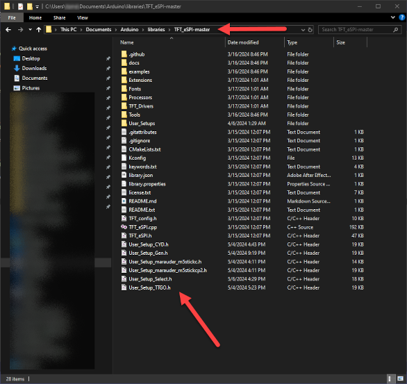
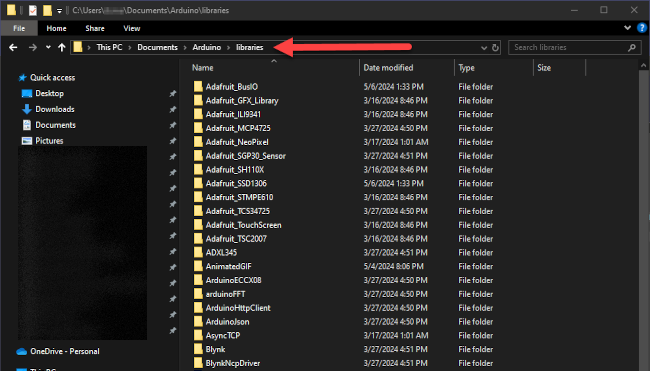

<div align="center">
  
## Arduino Enviroment files

</div>

<b>This section of the repo contains the libraries and user_setup files needed when building/compiling sketches for the TTGO T-Display.
Below are directions on how to add the libraries and user_setup files to the IDE enviroment.</b>
___

## Add ESP32 board support 
- Add ESP32 board support to the Arduino IDE.
<br>
In File > Preferences, add the following to 'Additional Board Manager URLs':

```
https://raw.githubusercontent.com/espressif/arduino-esp32/gh-pages/package_esp32_index.json
```
___

# USB driver/s
Make sure you Install drivers according to your machine. 
- [CHxxx Series MAC driver](http://www.wch-ic.com/downloads/CH34XSER_MAC_ZIP.html) 
- [CHxxx Series Windows driver](http://www.wch-ic.com/downloads/CH343SER_ZIP.html) 
- [CP21xx Series driver](https://www.silabs.com/developers/usb-to-uart-bridge-vcp-drivers?tab=downloads)
___

<br>

## Directions For Adding Libraries
- Download the <a href=https://github.com/ATOMNFT/ESP32-TTGO-T-Display-Hub/blob/main/Arduino%20Files/Libraries/libraries.zip>libraries zip</a> in this repo. Unzip the contents, and add the folders to **C:\Users\YOURNAME\Documents\Arduino\libraries** 
<br>



___

## Directions For Adding User_Setup Files
- Download the The <a href=https://github.com/ATOMNFT/ESP32-TTGO-T-Display-Hub/tree/main/Arduino%20Files/User_Setup%20Files>user_setup files</a> and add them to your **C:\Users\YOURNAME\Documents\Arduino\libraries\TFT_eSPI-master** folder.
<br>




<hr>
<br>