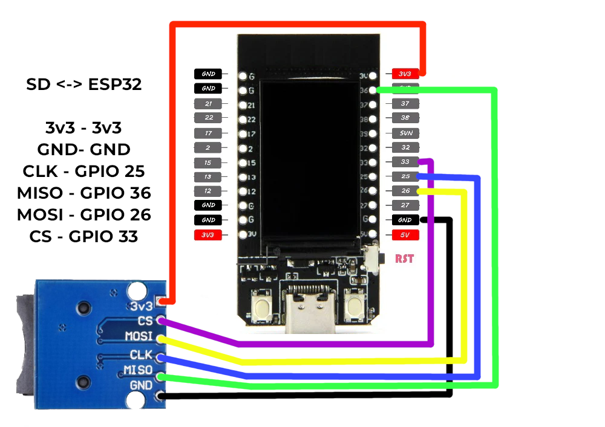

 

  
  ## My projects for the TTGO T-Display

All projects will be located here for easy access. 
Before trying out one of the projects here, head over to <a href=https://github.com/ATOMNFT/ESP32-TTGO-T-Display-Hub/tree/main/Arduino%20Files>Arduino Enviroment Files</a> and install the required files to use 
the T-Display in Arduino IDE. Below is a image showing SD breakout wiring.

  

---

⚡️ WiFi Tools

 

- <a href=https://github.com/ATOMNFT/ESP32-TTGO-T-Display-Hub/tree/main/Projects/ttgo-wifi-sniff>ttgo-wifi-sniff</a>
- <a href=https://github.com/ATOMNFT/ESP32-TTGO-T-Display-Hub/tree/main/Projects/ttgo_netscan>Net-Scan</a>
- <a href=https://github.com/ATOMNFT/ESP32-TTGO-T-Display-Hub/tree/main/Projects/PacketMonitor32>PacketMonitor32-Port</a>

---

🤑 Crypto Price Tickers

 

- <a href=https://github.com/ATOMNFT/ESP32-TTGO-T-Display-Hub/tree/main/Projects/crypto-price>crypto-price</a>

---

🛠️ Pwnagotchi Tools

 

- <a href=https://github.com/ATOMNFT/ESP32-TTGO-T-Display-Hub/tree/main/Projects/TDisplay-PwnInfo>TDisplay-PwnInfo</a>

---
  
  ## Device Compatibility

These sketches Successfully tested on
- [TTGO T-Display](https://www.aliexpress.us/item/3256805784238887.html?spm=a2g0o.order_list.order_list_main.17.1ecc1802gBNP2R&gatewayAdapt=glo2usa)
