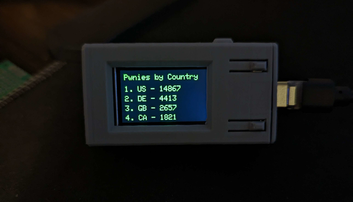
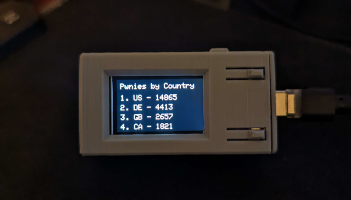

 

  
  ## T-display Pwny Info

<b>A very simple test project that displays pwnagotchi totals per country. A total of 8 are displayed with 4 at time per page.</b>
 
<b>(Make sure the ino is insode the folder titled same as the .ino file) Download the zip file above and extract. Load the .ino in Arduino IDE.</b>

 
  
  ## Device Compatibility

Successfully tested on
- [TTGO T-Display](https://www.aliexpress.us/item/3256805784238887.html?spm=a2g0o.order_list.order_list_main.17.1ecc1802gBNP2R&gatewayAdapt=glo2usa)
