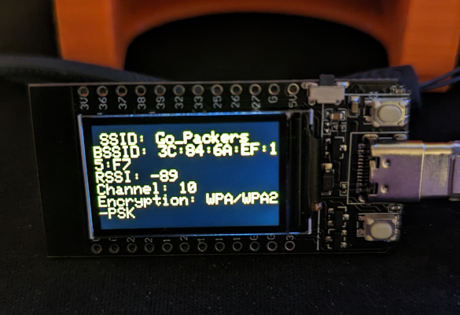

 

  
  ## Net-Scan 2 (Simple network scanner)

<b>A very simple test project that displays wifi networks around. You can use button A to cycle through the networks, and button B to rescan.</b>
 
<b>Download the zip file above and open the .ino in Arduino IDE.</b>

 
  
  ## Device Compatibility

Successfully tested on
- [TTGO T-Display](https://www.aliexpress.us/item/3256805784238887.html?spm=a2g0o.order_list.order_list_main.17.1ecc1802gBNP2R&gatewayAdapt=glo2usa)
