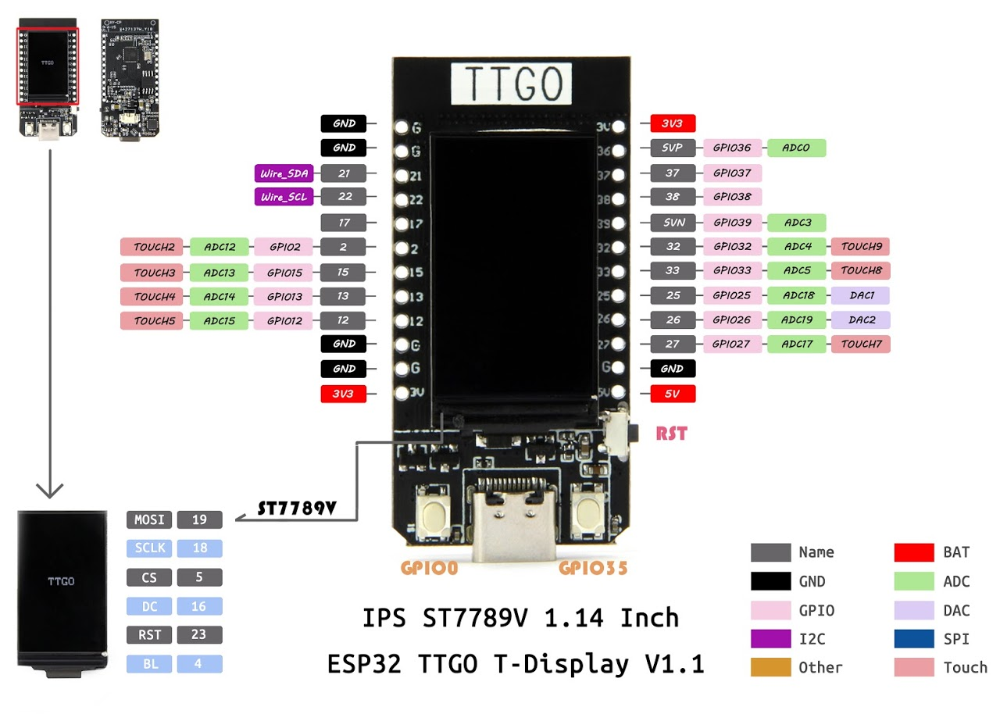

 

  
## A spot for all things TTGO T-Display (1.14in)

<b>Prepare to delve into a treasure trove of innovation! Within this repository, I'll be infusing a rich tapestry of IDE sketches, supplemented with comprehensive documentation and supplementary materials. 

 

Expect to uncover a wealth of insights tailor-made for the captivating 1.14-inch TTGO T-Display.

---

Before diving into the projects you should take a look at the Arduino Enviroment Files section and install the required libs and user_setup files.

## 📁 Repo Directory 📁

- <a href=https://github.com/ATOMNFT/ESP32-TTGO-T-Display-Hub/tree/main/Arduino%20Files>Arduino Enviroment Files</a>
- <a href=https://github.com/ATOMNFT/ESP32-TTGO-T-Display-Hub/tree/main/Projects>TTGO T-Display Projects</a>

 

---

## GPIO Pinout

(Credit to the orginal copywrite creator)

 

---
  
### Device Compatibility

These sketches Successfully tested on
- [TTGO T-Display](https://www.aliexpress.us/item/3256805784238887.html?spm=a2g0o.order_list.order_list_main.17.1ecc1802gBNP2R&gatewayAdapt=glo2usa)
